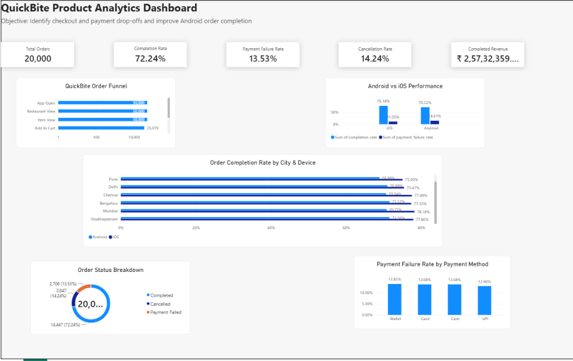

# QuickBite Product Analytics

An end-to-end Product Analytics case study for a simulated B2C food-delivery application.

## Project Overview

QuickBite analyzes customer ordering behavior, checkout activity, payment outcomes, and user-event data to identify opportunities for improving order completion.

The project combines:

* SQL and MySQL for data analysis
* Power BI for dashboarding
* Python for synthetic data generation
* Product Analytics for segmentation and funnel analysis
* PRD development for translating insights into a product solution

## Business Problem

The analysis investigates where users drop off during the food-ordering journey and whether specific customer segments experience higher friction.

The dataset contains:

| Dataset     | Records |
| ----------- | ------: |
| Users       |  10,000 |
| Restaurants |     300 |
| Menu Items  |   5,000 |
| Orders      |  20,000 |
| Order Items |  49,961 |
| Events      | 254,129 |

## Key Findings

* Overall order completion rate: **72.24%**
* Payment failure rate: **13.53%**
* Cancellation rate: **14.24%**
* Android completion rate: **70.52%**
* iOS completion rate: **76.18%**
* Android payment failure rate: **14.61%**
* iOS payment failure rate: **11.05%**
* Pune Android completion rate: **68.88%**
* Hyderabad Android completion rate: **69.24%**

Payment-method differences were relatively narrow, so the analysis focused on the broader checkout and payment-recovery experience rather than a single payment method.

## Product Insight

The analysis identified an opportunity to improve payment recovery for Android users.

### Proposed Feature

**Smart Payment Recovery**

The proposed experience includes:

* Clear payment-failure messaging
* One-tap payment retry
* Cart and checkout preservation
* Alternative payment methods
* Clear payment-processing status
* Duplicate-payment protection

## Dashboard

The Power BI dashboard includes:

* KPI summary
* Order funnel
* Android vs iOS performance
* City + device segmentation
* Order status breakdown
* Payment-method analysis

## Experiment Design

The proposed feature would be tested using an A/B experiment:

**Control:** Existing checkout experience

**Treatment:** Smart Payment Recovery

### Primary KPI

**Order Completion Rate**

### Secondary Metrics

* Payment Recovery Rate
* Payment Failure Rate
* Checkout-to-Order Conversion
* Average Order Value

### Guardrail Metrics

* Cancellation Rate
* Refund Rate
* Duplicate Payment Attempts
* Customer Complaints
* Payment Processing Time

## Business Opportunity Scenario

At the current order volume, increasing completion from **72.24% to 76%** would correspond to approximately **753 additional completed orders**.

Using the current average order value of **₹1,781.16**, this represents approximately **₹13.41 lakh** in scenario-based revenue opportunity.

This is an estimate based on synthetic data, not a production forecast.

## Project Files

### Documentation

* `docs/QuickBite_Product_Brief.md`
* `docs/QuickBite_PRD.md`
* `docs/QuickBite_Case_Study.md`

### Dashboard

* `QuickBite_Product_Analytics.pbix`

### Data Preparation

* `generate_data.py`
* `import_data.py`
* `import_events.py`

## Tools & Technologies

`MySQL` `SQL` `Power BI` `Python` `Product Analytics` `A/B Testing` `PRD`

## Limitations

This project uses a synthetic dataset created for portfolio and learning purposes. The findings should be treated as analytical hypotheses and would need validation using real production data.

## Outcome

This project demonstrates an end-to-end workflow:
Data
 ↓
SQL Analysis
 ↓
Segmentation
 ↓
Power BI Dashboard
 ↓
Product Insight
 ↓
Feature Hypothesis
 ↓
PRD
 ↓
Experiment Design
 ↓
Business Impact
## 📊 Dashboard Preview

**Download Interactive File:** [QuickBite_Product_Analytics.pbix](QuickBite_Product_Analytics.pbix)
